# vc-belegapp

Self-hosted, single-user PWA that photographs a meal receipt (Beleg), estimates the employer meal subsidy (Essenszuschuss), and produces a monthly PDF (Monatsexport) for payroll. The interface is German.

[](https://github.com/BlackDark/vc-belegapp/actions/workflows/ci.yml)
[](https://github.com/BlackDark/vc-belegapp/releases)
[](LICENSE)
[](https://github.com/BlackDark/vc-belegapp/pkgs/container/vc-belegapp)
[](go.mod)

## Screenshots

Dark theme. October 2026 sample from [docs/SPEC.md](docs/SPEC.md) §6.5: REWE 8,40 €, Bäckerei Kruse 6,20 €, Edeka 14,90 € corrected to 12,50 €, Lidl 7,67 €, Kiosk 3,80 €. The profile (Alex Beispiel, Beispiel GmbH) is fictional. Receipt images are drawn by the test, not photographs. `make screenshots` regenerates this set ([docs/development.md](docs/development.md)).

<table>
  <thead>
    <tr><th></th><th>Desktop</th><th>Phone</th></tr>
  </thead>
  <tbody>
    <tr>
      <td>Login</td>
      <td>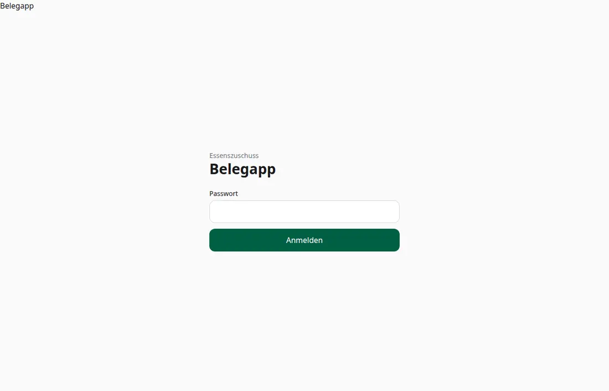</td>
      <td>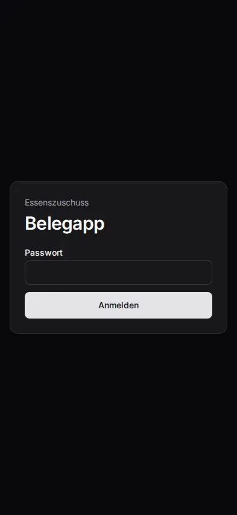</td>
    </tr>
    <tr>
      <td>Heute</td>
      <td>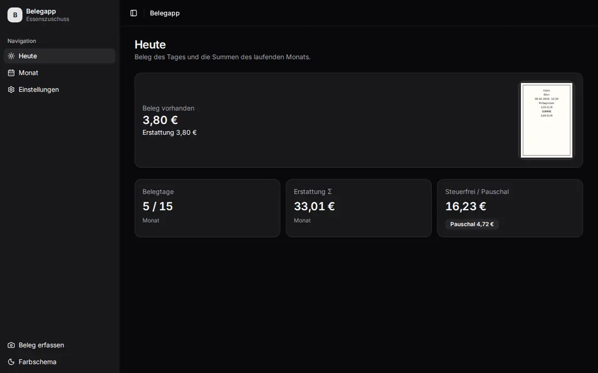</td>
      <td>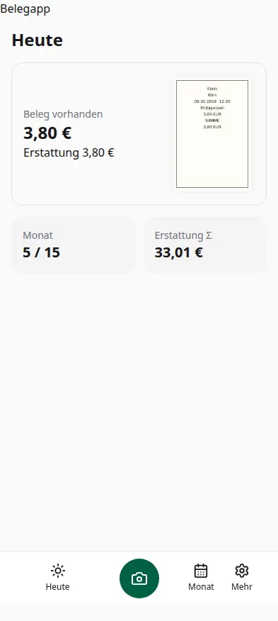</td>
    </tr>
    <tr>
      <td>Erfassen</td>
      <td>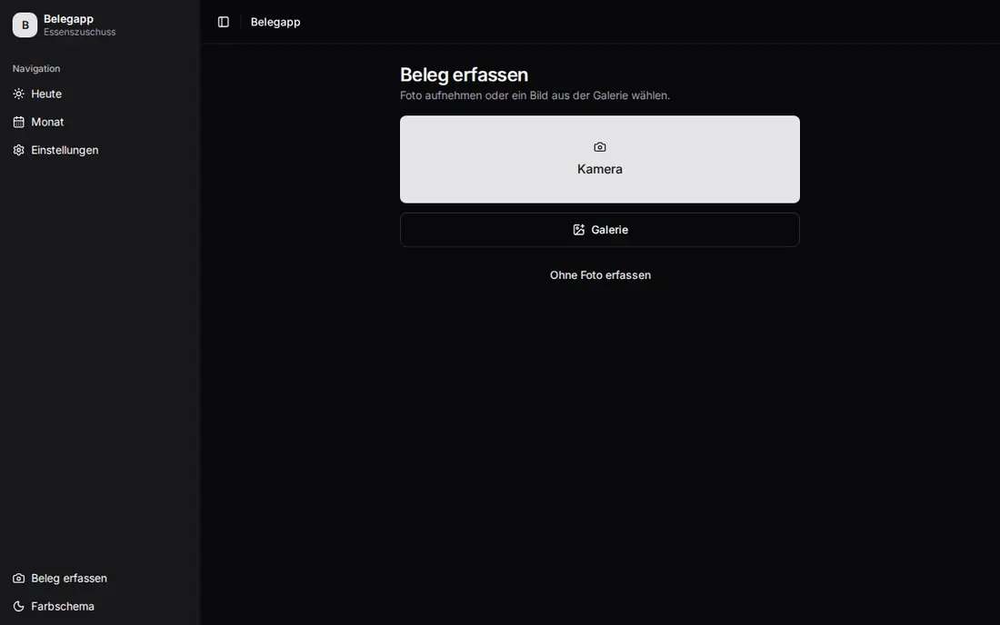</td>
      <td>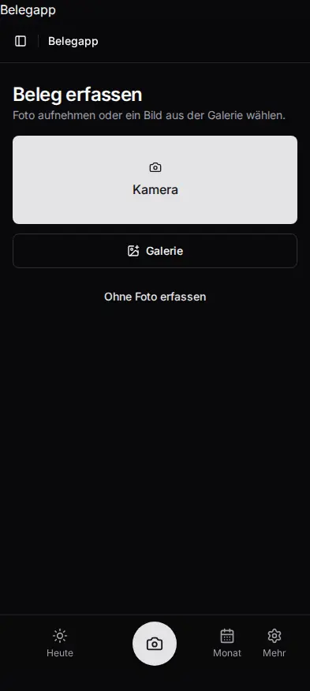</td>
    </tr>
    <tr>
      <td>Prüfen</td>
      <td>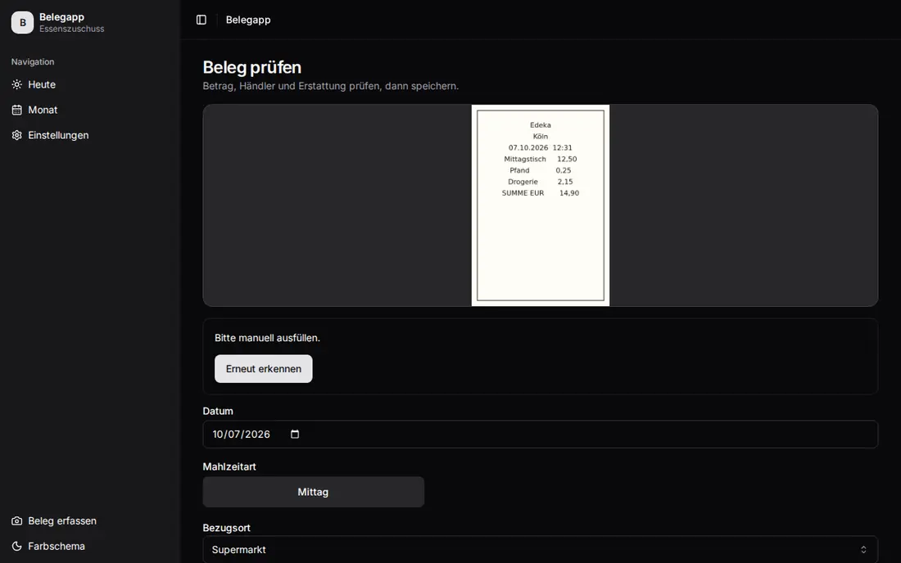</td>
      <td>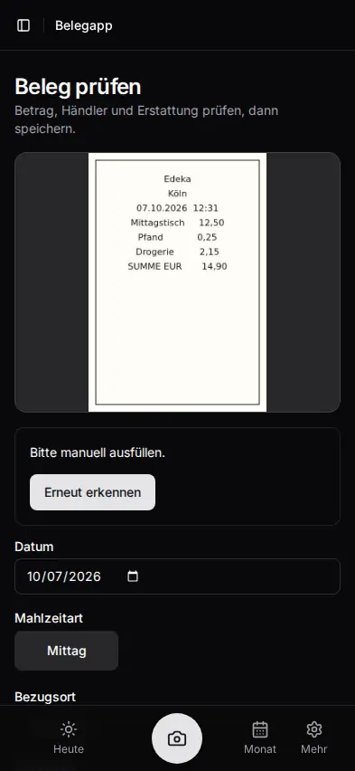</td>
    </tr>
    <tr>
      <td>Monat</td>
      <td>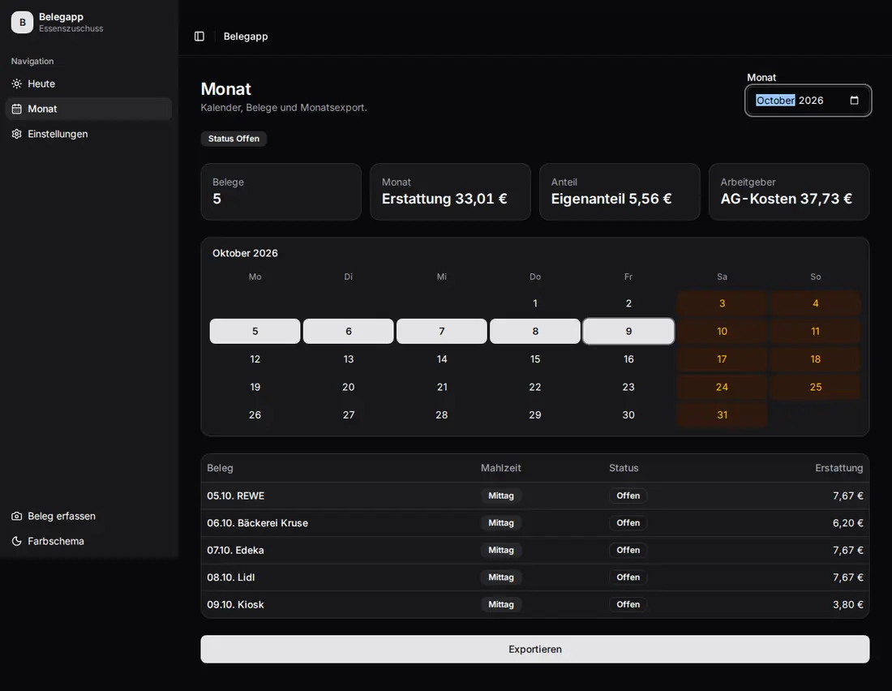</td>
      <td>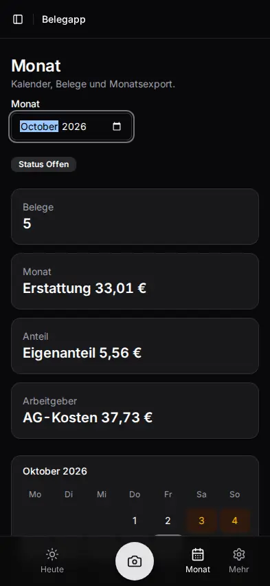</td>
    </tr>
    <tr>
      <td>Monatsexport</td>
      <td>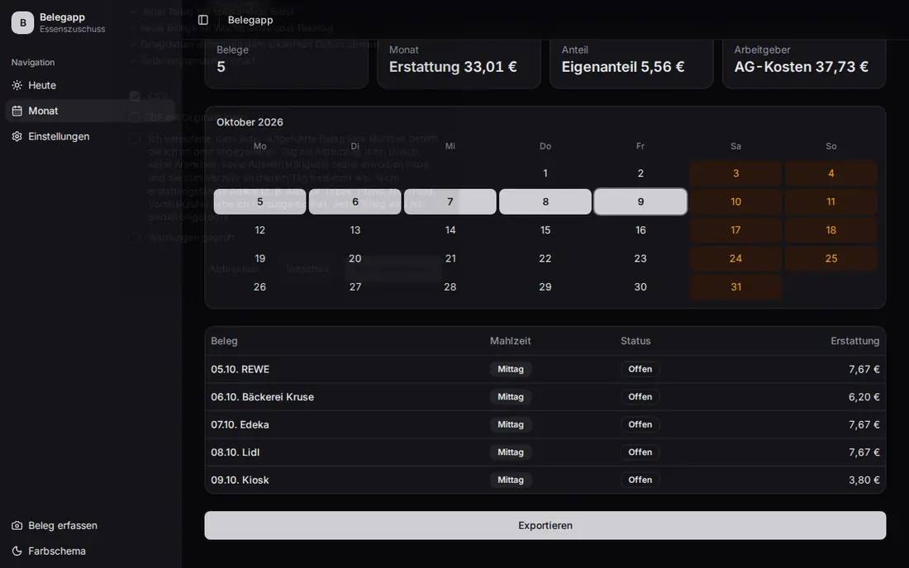</td>
      <td>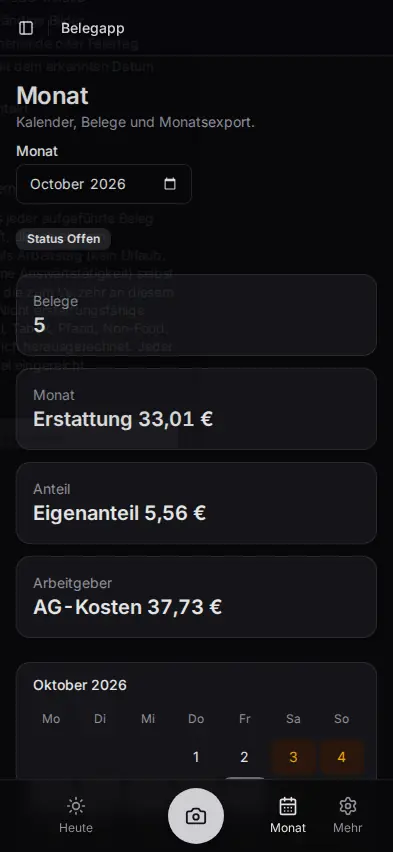</td>
    </tr>
    <tr>
      <td>Jahresregel</td>
      <td>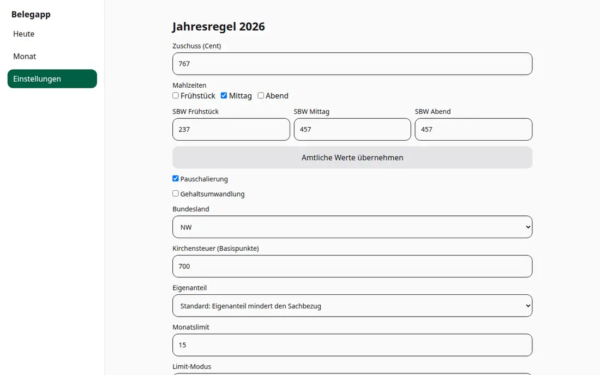</td>
      <td>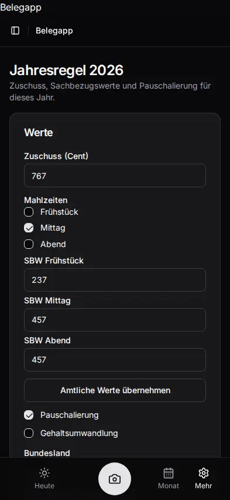</td>
    </tr>
    <tr>
      <td>Einstellungen</td>
      <td>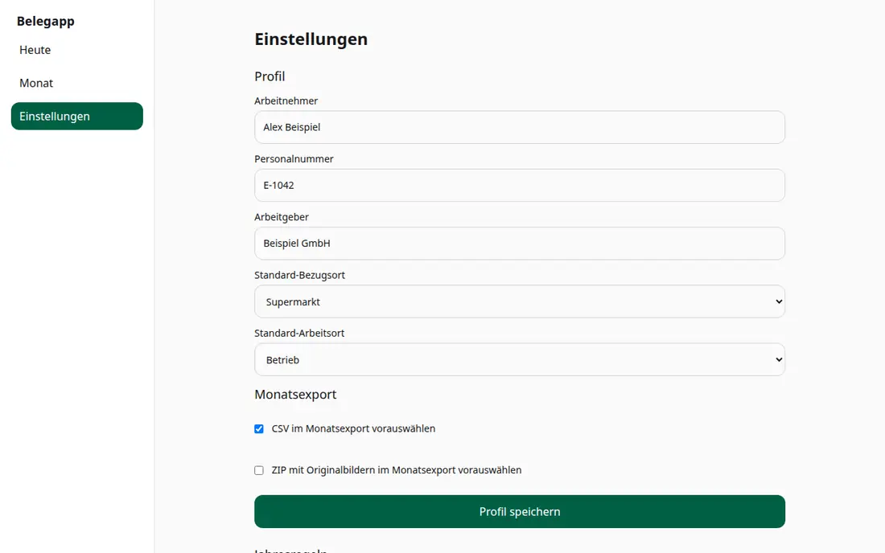</td>
      <td>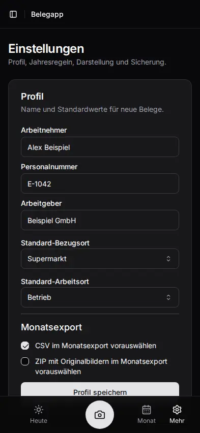</td>
    </tr>
  </tbody>
</table>

## Features

- Password login (argon2id) and OIDC (authorization code + PKCE), one user, session cookie.
- Photo or gallery upload, up to three images per Beleg. The server normalises to JPEG and strips EXIF.
- Optional receipt recognition (Belegerkennung) through any OpenAI-compatible `/chat/completions` endpoint, including Ollama. Recognition only pre-fills; saving never waits on it.
- Live figures and warnings (weekend, holiday, month cap, duplicates, subsidy above the ceiling).
- Month calendar, Prüfpunkte (pass / warning / fail checks), draft PDF, and a final Monatsexport (PDF, optional CSV and ZIP).
- Final export locks the month (Gesperrter Monat). Later edits require an Änderungsgrund and a new export version.
- Append-only audit log (Änderungsprotokoll) with a SHA-256 hash chain (`belegapp verify-audit`).
- Full-instance backup and restore (Datenexport / Datenimport).
- Blob store on disk or S3. SQLite stays on a local volume.
- Optional Prometheus metrics. `/healthz` and `/readyz`.

## Quickstart

The process runs as UID/GID 65532, with a read-only root filesystem, no capabilities, and no new privileges. Writable paths are the data volume and a tmpfs on `/tmp`. A named volume inherits ownership from the image. A bind mount needs `chown -R 65532:65532` first. `serve` exits 2 until a password hash or OIDC is configured.

Image tags have no `v` prefix. Git tag `v1.1.1` is the image `1.1.1`, plus `1.1`, `1`, and `latest`.

### Docker

```bash
printf '%s' 'a-long-password' | docker run --rm -i --entrypoint /belegapp \
  ghcr.io/blackdark/vc-belegapp:1.1.1 hash-password

docker volume create belegapp-data
docker run -d --name belegapp \
  --read-only \
  --user 65532:65532 \
  --cap-drop ALL \
  --security-opt no-new-privileges:true \
  --tmpfs /tmp:rw,nosuid,size=64m \
  -v belegapp-data:/data \
  -p 127.0.0.1:8080:8080 \
  -e BELEGAPP_AUTH_PASSWORD_HASH='<argon2id PHC>' \
  ghcr.io/blackdark/vc-belegapp:1.1.1
```

Open `http://127.0.0.1:8080`. `/healthz` returns `ok`. `/readyz` is 200 when SQLite, migrations, the blob store, and `typst --version` are fine, otherwise 503. The image has no curl; the healthcheck is `belegapp healthcheck`.

### Docker Compose

Copy [deploy/.env.example](deploy/.env.example) to `deploy/.env` and point the secret files at an OIDC client secret, an argon2id hash, and an LLM API key. `${VAR:?}` makes Compose refuse to start while a required value is empty.

```bash
docker compose --env-file deploy/.env -f deploy/docker-compose.yml up -d
```

Kubernetes, a standalone binary, a reverse proxy, and OIDC are in [docs/deployment.md](docs/deployment.md).

## Documentation

| Page | What it covers |
| --- | --- |
| [Configuration](docs/configuration.md) | Every `BELEGAPP_` variable, including `_FILE` secrets |
| [Deployment](docs/deployment.md) | Docker, Compose, Kubernetes/Kustomize, binary, reverse proxy, OIDC |
| [Calculation](docs/calculation.md) | Zuschuss, Sachbezug, Pauschalsteuer, and the disclaimer |
| [Backup](docs/backup.md) | Datenexport and restore |
| [Development](docs/development.md) | Architecture, make targets, end-to-end tests, screenshots |
| [Releases](docs/releases.md) | release-please, GoReleaser, Cosign verification |

Specification and decisions:

- [docs/SPEC.md](docs/SPEC.md) — product specification
- [docs/GLOSSARY.md](docs/GLOSSARY.md) — German terms
- [docs/DATENEXPORT.md](docs/DATENEXPORT.md) — zip layout and rejection codes
- [0001](docs/adr/0001-go-single-binary-sqlite.md) — one Go binary, SQLite, embedded SolidJS
- [0002](docs/adr/0002-typst-pdf.md) — Monatsexport via the Typst CLI, PDF/A-2b
- [0003](docs/adr/0003-auth-passwort-und-oidc.md) — password and OIDC together
- [0004](docs/adr/0004-storage-fs-und-s3.md) — blobs on disk or S3, content-addressed
- [0005](docs/adr/0005-monatssperre-aenderungsprotokoll.md) — month lock and hash-chained audit log
- [0006](docs/adr/0006-belegerkennung-openai-kompatibel.md) — recognition over OpenAI-compatible chat completions

Background: [docs/NOTES.md](docs/NOTES.md), [docs/research/steuer.md](docs/research/steuer.md), [docs/research/stack.md](docs/research/stack.md).

## License

MIT. See [LICENSE](LICENSE).
