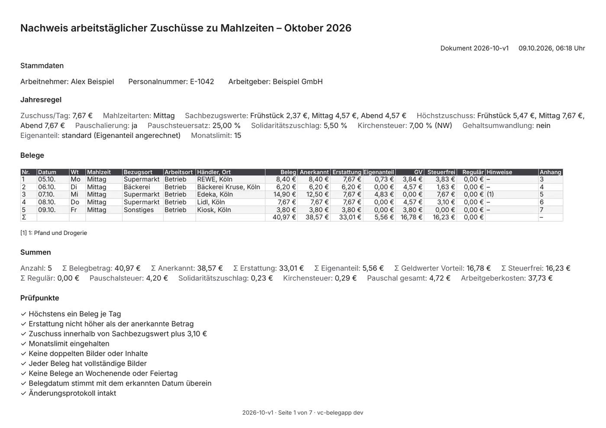
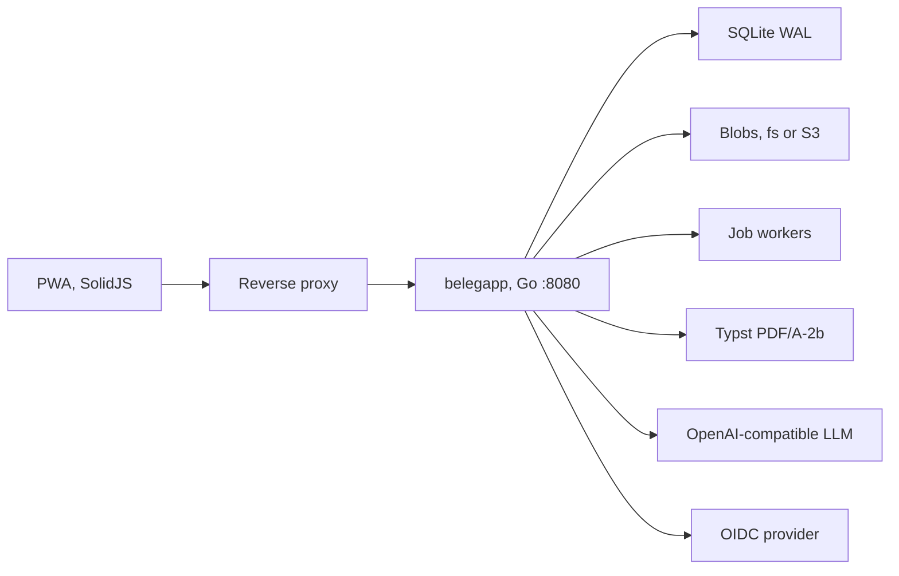

# vc-belegapp

Self-hosted, single-user PWA that photographs a meal receipt (Beleg), estimates the employer meal subsidy (Essenszuschuss), and produces a monthly PDF (Monatsexport) for payroll. The interface is German.

[](https://github.com/BlackDark/vc-belegapp/actions/workflows/ci.yml)
[](https://github.com/BlackDark/vc-belegapp/releases)
[](LICENSE)
[](https://github.com/BlackDark/vc-belegapp/pkgs/container/vc-belegapp)
[](go.mod)

## Screenshots

October 2026 sample from [docs/SPEC.md](docs/SPEC.md) §6.5: REWE 8,40 €, Bäckerei Kruse 6,20 €, Edeka 14,90 € corrected to 12,50 €, Lidl 7,67 €, Kiosk 3,80 €. The profile (Alex Beispiel, Beispiel GmbH) is fictional. Receipt images are drawn by the test, not photographs. `make screenshots` regenerates this set.

<table>
  <thead>
    <tr><th></th><th>Desktop</th><th>Phone</th></tr>
  </thead>
  <tbody>
    <tr>
      <td>Login</td>
      <td></td>
      <td></td>
    </tr>
    <tr>
      <td>Heute</td>
      <td></td>
      <td></td>
    </tr>
    <tr>
      <td>Erfassen</td>
      <td></td>
      <td></td>
    </tr>
    <tr>
      <td>Prüfen</td>
      <td></td>
      <td></td>
    </tr>
    <tr>
      <td>Monat</td>
      <td></td>
      <td></td>
    </tr>
    <tr>
      <td>Monatsexport</td>
      <td></td>
      <td></td>
    </tr>
    <tr>
      <td>Jahresregel</td>
      <td></td>
      <td></td>
    </tr>
    <tr>
      <td>Einstellungen</td>
      <td></td>
      <td></td>
    </tr>
  </tbody>
</table>

Page 1 of the final Monatsexport (PDF/A-2b). A draft carries a diagonal ENTWURF watermark and does not lock the month.



## Features

- Password login (argon2id) and OIDC (authorization code + PKCE), one user, session cookie.
- Photo or gallery upload, up to three images per Beleg. The server normalises to JPEG and strips EXIF.
- Optional receipt recognition (Belegerkennung) through any OpenAI-compatible `/chat/completions` endpoint, including Ollama. Recognition only pre-fills; saving never waits on it.
- Live figures and warnings (weekend, holiday, month cap, duplicates, subsidy above the ceiling).
- Month calendar, Prüfpunkte (pass / warning / fail checks), draft PDF, and a final Monatsexport (PDF, optional CSV and ZIP).
- Final export locks the month (Gesperrter Monat). Later edits require an Änderungsgrund and a new export version.
- Append-only audit log (Änderungsprotokoll) with a SHA-256 hash chain (`belegapp verify-audit`).
- Full-instance backup and restore (Datenexport / Datenimport).
- Blob store on disk or S3. SQLite stays on a local volume.
- Optional Prometheus metrics. `/healthz` and `/readyz`.

## How the calculation works

> **Keine Steuerberatung.** This is not tax advice. The app documents Belege and prepares figures. The employer's payroll (Lohnabrechnung) is what counts. The PDF and the UI say so.

Amounts are integer cents. Rates are basis points (1 bp = 0.01%). The Sachbezugswert (SBW) is the official value of one meal for that year (2026: breakfast 2,37 €, lunch and dinner 4,57 €). The Höchstzuschuss is that SBW plus 3,10 €. A Zuschuss above the Höchstzuschuss is treated as regular taxable wages.

Per Beleg, with meal value `A` (corrected amount if set, otherwise the receipt total), daily subsidy `Z`, and SBW `S`:

```
E = min(Z, A)                         Erstattung (amount paid back)
U = A - E                             Eigenanteil (employee share)
H = S + 3,10 €                        Höchstzuschuss
if the meal type is not subsidised:   E = U = G = F = R = 0
if Z > H:                             G = 0, F = 0, R = E
else, variant standard:               G = max(0, min(E, S - U)), F = E - G, R = 0
else, variant vorsichtig:             G = min(E, S), F = E - G, R = 0
```

`G` is the geldwerter Vorteil (taxable benefit), `F` the tax-free part, `R` the part taxed as normal wages.

For the month, when Pauschalierung is on, Pauschalsteuer is 25% wage tax on the sum of `G`, plus Solidaritätszuschlag and Kirchensteuer, paid by the employer. Lohnsteuer is rounded half up; Soli and Kirchensteuer are rounded down. With the default rates (25%, Soli 5,5%, Kirchensteuer from the Bundesland):

```
LSt  = (ΣG × pauschsteuersatz_bp + 5000) div 10000
Soli = (LSt × soli_satz_bp) div 10000
KiSt = (LSt × kist_satz_bp) div 10000
employer cost = ΣE + LSt + Soli + KiSt
```

With Pauschalierung off, those three taxes are 0 and `ΣG + ΣR` is left as individually taxable wages.

October 2026, lunch, North Rhine-Westphalia, subsidy 7,67 €, the five receipts above: Erstattung 33,01 €, geldwerter Vorteil 16,78 €, Lohnsteuer 4,20 €, Soli 0,23 €, Kirchensteuer 0,29 €, employer cost 37,73 €. Vectors and the other variant live in [docs/SPEC.md](docs/SPEC.md) §6.

## Quickstart

The process runs as UID/GID 65532, with a read-only root filesystem, no capabilities, and no new privileges. Writable paths are the data volume and a tmpfs on `/tmp`. A named volume inherits ownership from the image. A bind mount needs `chown -R 65532:65532` first. `serve` exits 2 until a password hash or OIDC is configured.

### Docker

Published tags have no `v` prefix: `1.0.0`, `1.0`, `1`, and `latest` on `ghcr.io/blackdark/vc-belegapp`.

```bash
printf '%s' 'a-long-password' | docker run --rm -i --entrypoint /belegapp \
  ghcr.io/blackdark/vc-belegapp:1.0.0 hash-password

docker volume create belegapp-data
docker run -d --name belegapp \
  --read-only \
  --user 65532:65532 \
  --cap-drop ALL \
  --security-opt no-new-privileges:true \
  --tmpfs /tmp:rw,nosuid,size=64m \
  -v belegapp-data:/data \
  -p 127.0.0.1:8080:8080 \
  -e BELEGAPP_AUTH_PASSWORD_HASH='<argon2id PHC>' \
  ghcr.io/blackdark/vc-belegapp:1.0.0
```

`/healthz` returns `ok`. `/readyz` is 200 when SQLite, migrations, the blob store, and `typst --version` are fine, otherwise 503. The image is `gcr.io/distroless/static-debian13:nonroot` plus a static Typst 0.15.1 binary, so the healthcheck is `belegapp healthcheck` (no curl).

`docker build -t vc-belegapp:dev .` compiles the web bundle and the Go binary inside the image. CI and releases do not use that Dockerfile. They copy a host-built `linux/$TARGETARCH/belegapp` with `Dockerfile.goreleaser` (`make docker-prebuilt` does the same locally).

### Docker Compose

[deploy/docker-compose.yml](deploy/docker-compose.yml) and [deploy/.env.example](deploy/.env.example). Copy the example to `deploy/.env` and point the secret files at an OIDC client secret, an argon2id hash, and an LLM API key. `${VAR:?}` makes Compose refuse to start while a required value is empty. The example is read-only, UID 65532, capabilities dropped, 1 CPU / 512 MiB.

```bash
docker compose --env-file deploy/.env -f deploy/docker-compose.yml up -d
```

### Kubernetes

[deploy/k8s](deploy/k8s) is Kustomize: one replica, `Recreate` (SQLite), UID 65532, read-only root, a PVC at `/data`, an `emptyDir` at `/tmp`, a Service, an Ingress (`proxy-body-size: 4g`), and a backup CronJob. Replace the placeholder hash in [deploy/k8s/secret.yaml](deploy/k8s/secret.yaml) before a real deploy. `networkpolicy.yaml` is not part of the default kustomization.

```bash
kubectl kustomize deploy/k8s
kubectl apply -k deploy/k8s
```

A ReadWriteOnce volume often cannot be mounted by the CronJob while the Deployment holds it. Use a storage class that allows a second mount on the same node, or run the backup on the host against the data directory.

### Standalone binary

Go 1.27.2, Node 24.21.0 (`.nvmrc`), pnpm 12.10.1 (`packageManager` in `web/package.json`). Typst 0.15.1 must be on `PATH` for PDFs and `/readyz` (`./scripts/install-typst.sh`).

```bash
pnpm -C web install --frozen-lockfile
pnpm -C web build
CGO_ENABLED=0 go build -trimpath -o bin/belegapp ./cmd/belegapp
mkdir -p data
printf '%s' 'a-long-password' | ./bin/belegapp hash-password
BELEGAPP_DATA_DIR="$PWD/data" \
BELEGAPP_LISTEN_ADDR="127.0.0.1:8080" \
BELEGAPP_COOKIE_SECURE=false \
BELEGAPP_AUTH_PASSWORD_HASH='<argon2id PHC>' \
  ./bin/belegapp serve
```

`serve` is the default. Also: `migrate`, `healthcheck [--url] [--timeout]`, `version`, `hash-password` (reads stdin, no echo), `verify-audit`, `backup --out <zip>`, `restore <zip> --yes`.

## Configuration

Every variable uses the prefix `BELEGAPP_`. A secret may be set as `BELEGAPP_<NAME>_FILE` (path; contents trimmed) instead of the value. Setting both is an error. `internal/config/readme_test.go` fails `go test` when a variable in code is missing from the table below, or when a default in code is not the backticked default cell.

<!-- config-env-start -->

| Variable | Default | Meaning |
| --- | --- | --- |
| `BELEGAPP_LISTEN_ADDR` | `:8080` | HTTP listen address |
| `BELEGAPP_BASE_URL` | empty | Public origin. Required for OIDC. Also the CSRF trusted origin |
| `BELEGAPP_DATA_DIR` | `/data` | Data directory |
| `BELEGAPP_DB_PATH` | `${DATA_DIR}/belegapp.db` | SQLite file |
| `BELEGAPP_TZ` | `Europe/Berlin` | Business time zone. Zone data is embedded |
| `BELEGAPP_LOG_LEVEL` | `info` | `debug`, `info`, `warn`, or `error` |
| `BELEGAPP_LOG_FORMAT` | `json` | `json` or `text` |
| `BELEGAPP_TRUSTED_PROXIES` | empty | Comma-separated CIDRs. `X-Forwarded-For` is honoured only from these |
| `BELEGAPP_SECRET_KEY`, `BELEGAPP_SECRET_KEY_FILE` | empty | 32 bytes, base64. Empty generates a key and stores it in the database. HMAC for the OIDC cookie |
| `BELEGAPP_COOKIE_SECURE` | `true` | `false` only for local HTTP. The cookie then drops the `__Host-` prefix |
| `BELEGAPP_SESSION_IDLE_TIMEOUT` | `720h` | Idle session lifetime |
| `BELEGAPP_SESSION_ABSOLUTE_TIMEOUT` | `2160h` | Absolute session lifetime. Must be at least the idle timeout |
| `BELEGAPP_AUTH_PASSWORD_HASH`, `BELEGAPP_AUTH_PASSWORD_HASH_FILE` | empty | argon2id PHC from `belegapp hash-password`. Empty disables password login |
| `BELEGAPP_OIDC_ISSUER_URL` | empty | Issuer. Empty disables OIDC |
| `BELEGAPP_OIDC_CLIENT_ID` | empty | Client id. Required when an issuer is set |
| `BELEGAPP_OIDC_CLIENT_SECRET`, `BELEGAPP_OIDC_CLIENT_SECRET_FILE` | empty | Empty means a public client (PKCE only) |
| `BELEGAPP_OIDC_SCOPES` | `openid profile email` | Space-separated scopes |
| `BELEGAPP_OIDC_ALLOWED_SUBJECTS` | empty | Comma-separated `sub` values |
| `BELEGAPP_OIDC_ALLOWED_EMAILS` | empty | Comma-separated emails. A match also requires `email_verified` |
| `BELEGAPP_OIDC_BUTTON_LABEL` | `Mit SSO anmelden` | Label of the OIDC button |
| `BELEGAPP_OIDC_RP_LOGOUT` | `false` | After local logout, redirect to the provider end-session endpoint when it exists |
| `BELEGAPP_STORAGE_BACKEND` | `fs` | `fs` or `s3` |
| `BELEGAPP_STORAGE_FS_DIR` | `${DATA_DIR}/blobs` | Filesystem blob directory |
| `BELEGAPP_S3_ENDPOINT` | empty | Host, for example `minio:9000`. Required for `s3` |
| `BELEGAPP_S3_REGION` | `us-east-1` | Region. Required for `s3` |
| `BELEGAPP_S3_BUCKET` | empty | Bucket. Required for `s3` |
| `BELEGAPP_S3_PREFIX` | `belegapp/` | Key prefix |
| `BELEGAPP_S3_ACCESS_KEY_ID`, `BELEGAPP_S3_ACCESS_KEY_ID_FILE` | empty | Access key |
| `BELEGAPP_S3_SECRET_ACCESS_KEY`, `BELEGAPP_S3_SECRET_ACCESS_KEY_FILE` | empty | Secret key |
| `BELEGAPP_S3_USE_TLS` | `true` | TLS to the endpoint |
| `BELEGAPP_S3_FORCE_PATH_STYLE` | `true` | Path-style addressing |
| `BELEGAPP_S3_SSE` | `false` | SSE-S3 |
| `BELEGAPP_LLM_ENABLED` | `true` | Global switch, in addition to the in-app Belegerkennung toggle |
| `BELEGAPP_LLM_BASE_URL` | `https://api.openai.com/v1` | OpenAI-compatible base URL. A trailing slash is optional |
| `BELEGAPP_LLM_API_KEY`, `BELEGAPP_LLM_API_KEY_FILE` | empty | Bearer token. Empty is valid for Ollama. Empty on the OpenAI host leaves recognition off |
| `BELEGAPP_LLM_MODEL` | `gpt-5-mini` | Model id |
| `BELEGAPP_LLM_RESPONSE_FORMAT` | `auto` | `json_schema`, `json_object`, or `auto` (schema first, then one fallback) |
| `BELEGAPP_LLM_REASONING_EFFORT` | empty | Sent only when set, for example `low` |
| `BELEGAPP_LLM_TIMEOUT` | `60s` | Recognition request timeout |
| `BELEGAPP_LLM_MAX_IMAGE_PX` | `1600` | Long edge of the JPEG sent to the model |
| `BELEGAPP_JOB_WORKERS` | `2` | Parallel recognition jobs |
| `BELEGAPP_UPLOAD_MAX_BYTES` | `15728640` | Image upload limit, 15 MiB |
| `BELEGAPP_IMPORT_MAX_BYTES` | `4294967296` | Datenimport limit, 4 GiB |
| `BELEGAPP_UNASSIGNED_IMAGE_TTL` | `24h` | Delete unassigned Belegbilder, then blobs nothing still references |
| `BELEGAPP_EXPORT_RETENTION_YEARS` | `10` | Retention clock, 1–100. `aufbewahrung_bis` is the end of the export's calendar year plus N years, in `BELEGAPP_TZ`. Nothing is deleted |
| `BELEGAPP_TYPST_BIN` | `typst` | Typst binary. The image uses `/usr/local/bin/typst` |
| `BELEGAPP_PDF_TIMEOUT` | `120s` | Monatsexport compile timeout |
| `BELEGAPP_METRICS_ADDR` | empty | Prometheus listen address, for example `:9090`. No authentication |

<!-- config-env-end -->

`serve` requires `BELEGAPP_AUTH_PASSWORD_HASH` or `BELEGAPP_OIDC_ISSUER_URL`. OIDC also needs a client id and at least one allowlist (`sub` or verified email). Incomplete OIDC or S3 configuration is a startup error. `migrate` does not need authentication. Discovery retries in the background; until it succeeds, `/auth/config` reports OIDC as off and the process still serves password login.

### Ollama

Leave the key empty. `auto` falls back to `json_object` when the server rejects `response_format`.

```bash
BELEGAPP_LLM_BASE_URL=http://127.0.0.1:11434/v1
BELEGAPP_LLM_API_KEY=
BELEGAPP_LLM_MODEL=qwen3-vl:8b
BELEGAPP_LLM_RESPONSE_FORMAT=auto
```

On the Compose network the host name is `ollama` (`http://ollama:11434/v1`). The request sends only the normalised JPEG, EXIF removed, rescaled to `BELEGAPP_LLM_MAX_IMAGE_PX`.

When `BELEGAPP_METRICS_ADDR` is set, the process exposes `belegapp_http_requests_total`, `belegapp_http_request_duration_seconds`, `belegapp_erkennung_total`, `belegapp_erkennung_dauer_seconds`, `belegapp_pdf_dauer_seconds`, `belegapp_jobs_wartend`, plus the Go and process collectors.

## Backup and restore

A Datenexport is a zip of the whole instance (SQLite snapshot, referenced blobs, CSV). It is separate from the Monatsexport. Import replaces the dataset; it does not merge. The server writes a safety copy first. Layout, rejection codes, and retention of unassigned images: [docs/DATENEXPORT.md](docs/DATENEXPORT.md).

In the app: Einstellungen → Datenexport, then Datenimport. The confirmation word is `ERSETZEN`. Every session ends after a successful import.

```bash
belegapp backup --out /data/backups/belegapp.zip
belegapp restore /data/backups/belegapp.zip --yes
```

`restore` refuses to run without `--yes`. Both commands use the same environment as `serve` (`BELEGAPP_DATA_DIR`, database path, storage backend).

The Kubernetes CronJob [deploy/k8s/cronjob.yaml](deploy/k8s/cronjob.yaml) runs `belegapp backup --out /data/backups/belegapp.zip` at 03:15. See the volume note under Kubernetes. A volume snapshot is a useful second copy; the zip is the format that round-trips blobs and the audit chain.

## Development

Prerequisites: Go 1.27.2 (`go` and `toolchain` in `go.mod`, `CGO_ENABLED=0`), Node 24.21.0, pnpm 12.10.1. PDF tests and screenshots also need Typst 0.15.1. Screenshot optimisation needs `pdftoppm` (poppler) and `python3-pil`.

```bash
make web              # biome, tsc, vitest, vite build
make test             # go test -race
make lint             # gofmt, golangci-lint, biome
make sqlc             # generate, vet, diff against a migrated database
make vuln             # govulncheck
make build            # web bundle, then bin/belegapp
make docker           # Dockerfile, toolchain inside the image
make docker-prebuilt  # host binary copied into distroless
make screenshots      # e2e/tests/screenshots.spec.ts, then docs/screenshots/*.webp
```

Queries live in `internal/db/queries`, migrations in `internal/db/migrations`. Generated sqlc code is committed. `web/dist` is embedded with `//go:embed`; CI replaces it with a fresh Vite build before compiling.

End-to-end tests start one server per test so workers do not share a database. They use `e2e/fakellm` and `e2e/mockoidc`.

```bash
pnpm -C e2e install --frozen-lockfile
pnpm -C e2e exec playwright install --with-deps chromium
cd e2e && pnpm test
```

CI passes `BELEGAPP_BIN` from the linux/amd64 job. Without it, Playwright runs `go run ./cmd/belegapp`. `screenshots.spec.ts` records the visible viewport (not the full scroll height) at 1280×800 on desktop and an iPhone 15 viewport (`Europe/Berlin`, dark theme). CI uploads the raw PNGs as `e2e-screenshots`. Commit the optimised WebPs under `docs/screenshots/` after `make screenshots`.

### Architecture



| Path | Role |
| --- | --- |
| `cmd/belegapp` | CLI |
| `internal/config` | Environment |
| `internal/server` | HTTP, headers, SPA, metrics |
| `internal/api` | `/api/v1` |
| `internal/auth` | Password, sessions, OIDC |
| `internal/calc` | Day and month formulas |
| `internal/pdf` | Typst templates |
| `internal/export` | Monatsexport and Datenexport |
| `internal/erkennung` | Receipt recognition |
| `internal/storage` | Filesystem and S3 |
| `web/` | SolidJS app, embedded from `web/dist` |
| `deploy/` | Compose and Kustomize |

Decisions: [docs/adr](docs/adr). Specification: [docs/SPEC.md](docs/SPEC.md). Terms: [docs/GLOSSARY.md](docs/GLOSSARY.md).

- [0001](docs/adr/0001-go-single-binary-sqlite.md) — one Go binary, SQLite, embedded SolidJS.
- [0002](docs/adr/0002-typst-pdf.md) — Monatsexport via the Typst CLI, PDF/A-2b.
- [0003](docs/adr/0003-auth-passwort-und-oidc.md) — password and OIDC together.
- [0004](docs/adr/0004-storage-fs-und-s3.md) — blobs on disk or S3, content-addressed.
- [0005](docs/adr/0005-monatssperre-aenderungsprotokoll.md) — month lock and hash-chained audit log.
- [0006](docs/adr/0006-belegerkennung-openai-kompatibel.md) — recognition over OpenAI-compatible chat completions.

### CI

| Workflow | When | What |
| --- | --- | --- |
| `ci.yml` | Pull request, push to `main`, dispatch | Web bundle, linux/amd64, linux/arm64, darwin, `go test`, PDF golden + veraPDF, Playwright, multi-arch image, Trivy, read-only smoke. `release-dry-run` runs the same GoReleaser setup as a tag (`release --snapshot --clean --skip=publish,sign,announce`) and fails if the checkout is dirty. |
| `release-please.yml` | Push to `main` | Release PR and, on merge, tag `vX.Y.Z`. Dispatches `ci.yml` on the release-PR branch and `release.yml` on the tag. |
| `release.yml` | Tag `v*` | Re-runs CI, smokes the image, GoReleaser. |
| `codeql.yml` | Pull request, weekly | CodeQL for Go and TypeScript |

`release-please` uses `GITHUB_TOKEN`. A pull request or tag created with that token does not start `pull_request` or `push` workflows, so the workflow dispatches the others itself with `gh workflow run --repo "$GITHUB_REPOSITORY"`. That job does not check out the repository; without `--repo`, `gh` fails looking for a git directory. Suggested rulesets that are not applied yet: [`.github/rulesets`](.github/rulesets).

## Release

Commits follow Conventional Commits. [release-please](https://github.com/googleapis/release-please) opens a release PR (changelog, version bump). Merging it tags `vX.Y.Z`. Do not tag by hand.

`release.yml` and `release-dry-run` both call [`.github/actions/goreleaser`](.github/actions/goreleaser/action.yml). That action installs Cosign and Syft outside the checkout, refuses a dirty tree, then runs GoReleaser v2 (`.goreleaser.yaml`):

- `linux` and `darwin`, `amd64` and `arm64`, `CGO_ENABLED=0`, archives include `LICENSE`, `README.md`, and `deploy/`
- checksums (`checksums.txt`), SBOMs (syft)
- multi-arch image `ghcr.io/blackdark/vc-belegapp` tagged `X.Y.Z`, `X.Y`, `X`, and `latest`
- Cosign keyless signatures: `checksums.txt.sigstore.json`, and the image by digest
- GitHub artifact attestations on `checksums.txt` and the image digest
- release notes come from release-please (`changelog.disable`, `release.mode: append`); the footer adds the image reference

The release notes name `ghcr.io/blackdark/vc-belegapp:<version>` (no `v`).

Verify a published image and the checksum signature. The identity is the release workflow on a `v*` tag:

```bash
cosign verify \
  --certificate-oidc-issuer https://token.actions.githubusercontent.com \
  --certificate-identity-regexp '^https://github.com/BlackDark/vc-belegapp/\.github/workflows/release\.yml@refs/tags/v' \
  ghcr.io/blackdark/vc-belegapp:1.0.0

cosign verify-blob \
  --certificate-oidc-issuer https://token.actions.githubusercontent.com \
  --certificate-identity-regexp '^https://github.com/BlackDark/vc-belegapp/\.github/workflows/release\.yml@refs/tags/v' \
  --bundle checksums.txt.sigstore.json \
  checksums.txt

gh attestation verify oci://ghcr.io/blackdark/vc-belegapp:1.0.0 --owner BlackDark
```

## License

MIT. See [LICENSE](LICENSE).
