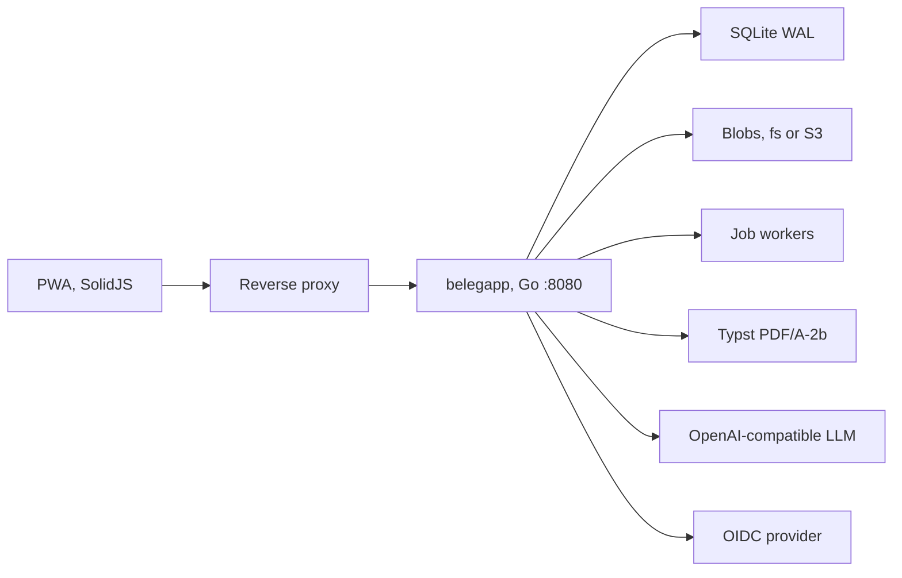

# Development

Prerequisites: Go 1.27.2 (`go` and `toolchain` in `go.mod`, `CGO_ENABLED=0`), Node 24.21.0, pnpm 12.10.1. PDF tests and screenshots also need Typst 0.15.1. Screenshot optimisation needs `pdftoppm` (poppler) and `python3-pil`.

```bash
make web              # biome, tsc, vitest, vite build
make test             # go test -race
make lint             # gofmt, golangci-lint, biome
make sqlc             # generate, vet, diff against a migrated database
make vuln             # govulncheck
make build            # web bundle, then bin/belegapp
make docker           # Dockerfile, toolchain inside the image
make docker-prebuilt  # host binary copied into distroless
make screenshots      # e2e/tests/screenshots.spec.ts, then docs/screenshots/*.webp
```

Queries live in `internal/db/queries`, migrations in `internal/db/migrations`. Generated sqlc code is committed. `web/dist` is embedded with `//go:embed`; CI replaces it with a fresh Vite build before compiling.

`go test` includes two documentation checks: [internal/config/readme_test.go](../internal/config/readme_test.go) compares the [configuration](configuration.md) table with the `BELEGAPP_` variables in code, and [internal/doccheck](../internal/doccheck/links_test.go) resolves relative links and image paths in Markdown.

## End-to-end tests

Each test starts its own server so workers do not share a database. The doubles are `e2e/fakellm` and `e2e/mockoidc`.

```bash
pnpm -C e2e install --frozen-lockfile
pnpm -C e2e exec playwright install --with-deps chromium
cd e2e && pnpm test
```

CI passes `BELEGAPP_BIN` from the linux/amd64 job. Without it, Playwright runs `go run ./cmd/belegapp`.

## Screenshots

`screenshots.spec.ts` records the visible viewport (not the full scroll height) at 1280×800 on desktop and an iPhone 15 viewport (`Europe/Berlin`, dark theme). CI uploads the raw PNGs as `e2e-screenshots`. Commit the optimised WebPs under [screenshots/](screenshots) after `make screenshots`. The [README](../README.md) grid uses those files.

Page 1 of the final Monatsexport (PDF/A-2b) for the same October 2026 sample. A draft carries a diagonal ENTWURF watermark and does not lock the month.


## Architecture



| Path | Role |
| --- | --- |
| `cmd/belegapp` | CLI |
| `internal/config` | Environment |
| `internal/server` | HTTP, headers, SPA, metrics |
| `internal/api` | `/api/v1` |
| `internal/auth` | Password, sessions, OIDC |
| `internal/calc` | Day and month formulas |
| `internal/pdf` | Typst templates |
| `internal/export` | Monatsexport and Datenexport |
| `internal/erkennung` | Receipt recognition |
| `internal/storage` | Filesystem and S3 |
| `web/` | SolidJS app, embedded from `web/dist` |
| `deploy/` | Compose and Kustomize |

Decisions: [adr](adr). Specification: [SPEC.md](SPEC.md). Terms: [GLOSSARY.md](GLOSSARY.md). Formulas: [calculation.md](calculation.md).

- [0001](adr/0001-go-single-binary-sqlite.md) — one Go binary, SQLite, embedded SolidJS.
- [0002](adr/0002-typst-pdf.md) — Monatsexport via the Typst CLI, PDF/A-2b.
- [0003](adr/0003-auth-passwort-und-oidc.md) — password and OIDC together.
- [0004](adr/0004-storage-fs-und-s3.md) — blobs on disk or S3, content-addressed.
- [0005](adr/0005-monatssperre-aenderungsprotokoll.md) — month lock and hash-chained audit log.
- [0006](adr/0006-belegerkennung-openai-kompatibel.md) — recognition over OpenAI-compatible chat completions.

## CI

| Workflow | When | What |
| --- | --- | --- |
| `ci.yml` | Push to any branch, dispatch, `workflow_call` | Web bundle, linux/amd64, linux/arm64, darwin, `go test` (including the Markdown link check), `govulncheck`, PDF golden + veraPDF, Playwright, multi-arch image, Trivy, read-only smoke. `release-dry-run` runs the same GoReleaser setup as a tag (`release --snapshot --clean --skip=publish,sign,announce`) and fails if the checkout is dirty. |
| `release-please.yml` | `workflow_dispatch` | Release PR, and on a second dispatch after that PR is merged, tag `vX.Y.Z`. Dispatches `ci.yml` on the release-PR branch and `release.yml` on the tag. Merging to `main` never releases; see [releases.md](releases.md#releasing). |
| `release.yml` | Tag `v*` | Re-runs CI, smokes the image, GoReleaser. |
| `codeql.yml` | Push to any branch, weekly | CodeQL for Go and TypeScript |

`release-please` uses `GITHUB_TOKEN`. A tag created with that token does not start workflows, so the workflow dispatches `release.yml` with `gh workflow run --repo "$GITHUB_REPOSITORY"`. That job does not check out the repository. Without `--repo`, `gh` fails looking for a git directory. The release steps themselves are in [releases.md](releases.md).

A pull request created with the same token does start `pull_request` workflows. GitHub holds them for approval, and an unapproved run finishes as a failure with no jobs. `ci.yml` and `codeql.yml` therefore trigger on a push to any branch. A push from `GITHUB_TOKEN` does not create a run, so a release PR does not get a red CI or CodeQL check from that event. The workflow still dispatches `ci.yml` on the release branch, and the pull request lists those checks. A push to a branch that has an open pull request reports its checks on the pull request. A pull request from a fork has no branch push in this repository, so it does not start these two workflows. Suggested rulesets that are not applied yet: [.github/rulesets](../.github/rulesets).
